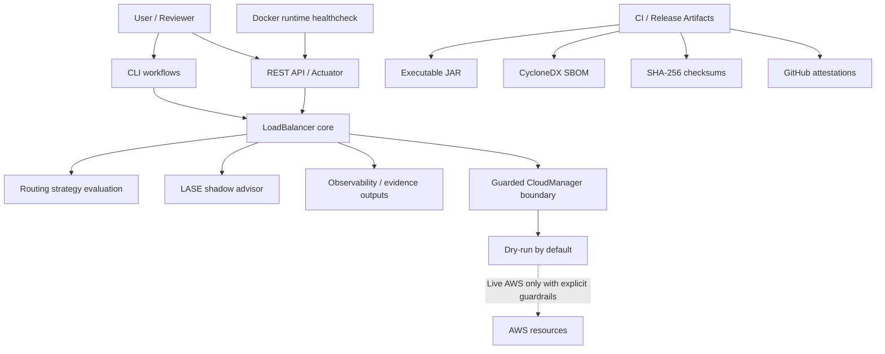

# LoadBalancerPro

LoadBalancerPro is a Java 17 / Spring Boot load-balancing simulator and cloud-safety demo with guarded AWS mutation paths, hardened API contracts, robust import/export handling, CLI workflows, observability endpoints, CI release gates, Docker runtime hardening, and comprehensive mocked test coverage.

It is built as a polished portfolio and enterprise-demo system: the code demonstrates production-minded boundaries, tests, packaging, and cloud guardrails, but it is not a drop-in production cloud load balancer.

The API and CLI are safe by default: allocation endpoints do not call AWS, CLI cloud integration is disabled unless requested, Docker/local runs do not require AWS credentials, and cloud mutation stays disabled unless every live-mode guardrail is configured explicitly.

## What This Project Demonstrates

- Java 17 and Spring Boot API design with validation, structured errors, health/metrics endpoints, OpenAPI docs, and conservative profile defaults.
- A guarded cloud boundary where AWS mutation is isolated in `com.richmond423.loadbalancerpro.core.CloudManager`, disabled by default, and covered through mocked tests.
- Package, release, and supply-chain discipline: semantic version tags, Maven/JAR alignment checks, CycloneDX SBOMs, SHA-256 checksums, GitHub attestations, and release evidence notes.
- Docker runtime hardening with a non-root user, container healthcheck, loopback-bound local smoke tests, and post-v2.4.0 runtime verification.
- Portfolio-grade engineering hygiene: focused dependency maintenance, documented residual risks, explicit safety boundaries, and evidence-backed claims.

## What This Project Is Not

- It is not production-certified infrastructure, a managed cloud load balancer, or a replacement for provider-native load-balancing services.
- It does not mutate live AWS resources unless live mode, operator intent, account/region/capacity guardrails, and dry-run opt-out are all configured explicitly.
- It does not claim production SLOs, unmanaged internet exposure readiness, complete identity/authorization, or production-grade secret rotation.
- LASE routing and shadow-advisor features are demo/research-grade foundations unless a section explicitly says a behavior is wired into public allocation flows.

## Current Release Evidence

- [GitHub Release v2.4.2](https://github.com/richmond423/LoadBalancerPro/releases/tag/v2.4.2) is the dependency-maintenance release for `org.json:json` and AWS SDK v2 BOM updates.
- [`docs/V2_4_2_DEPENDENCY_MAINTENANCE_RELEASE.md`](docs/V2_4_2_DEPENDENCY_MAINTENANCE_RELEASE.md) summarizes the v2.4.2 dependency scope and safety posture.
- [`docs/V2_4_0_RELEASE_ARTIFACT_EVIDENCE.md`](docs/V2_4_0_RELEASE_ARTIFACT_EVIDENCE.md) records the v2.4.0 release artifact, checksum, SBOM, and attestation evidence.
- [`docs/V2_4_0_DOCKER_RUNTIME_EVIDENCE.md`](docs/V2_4_0_DOCKER_RUNTIME_EVIDENCE.md) records Docker build/runtime verification after the v2.4.0 namespace migration.
- [`docs/V2_4_0_NAMESPACE_MIGRATION_RELEASE.md`](docs/V2_4_0_NAMESPACE_MIGRATION_RELEASE.md) summarizes the package namespace migration and downstream compatibility note.

## Release Timeline

- `v2.4.2`: dependency maintenance for `org.json:json` and AWS SDK v2 BOM updates.
- `v2.4.1`: compatibility maintenance after the namespace migration, including deprecated-shim caller cleanup, cloud metrics wrapper refactor, and README/CODEOWNERS/docs polish.
- `v2.4.0`: package namespace migration to `com.richmond423.loadbalancerpro.*` and Maven `groupId` `com.richmond423`.
- `v2.3.5`: GitHub Actions workflow maintenance for Node.js 24 action versions.
- `v2.3.4`: Caffeine dependency maintenance, `3.1.8` to `3.2.4`.
- `v2.3.3`: Gson dependency maintenance, `2.10.1` to `2.14.0`.

## Architecture Overview

The diagram shows the project boundaries: user entry points, core routing logic, shadow-only LASE analysis, guarded cloud integration, runtime health checks, and release evidence.



- Core load-balancing engine: `com.richmond423.loadbalancerpro.core.LoadBalancer`, `com.richmond423.loadbalancerpro.core.Server`, and related strategy/result types model server health, capacity, weighted distribution, predictive allocation, and failure handling.
- LASE telemetry/scoring/routing foundation: `com.richmond423.loadbalancerpro.core.ServerStateVector`, `com.richmond423.loadbalancerpro.core.ServerScoreCalculator`, `com.richmond423.loadbalancerpro.core.RoutingDecision`, and `com.richmond423.loadbalancerpro.core.TailLatencyPowerOfTwoStrategy` provide an internal foundation for tail-latency-aware, queue-aware, explainable routing decisions. This foundation is intentionally not wired into the public allocation flows yet.
- ServerMonitor / health monitoring: `com.richmond423.loadbalancerpro.core.ServerMonitor` tracks local and mocked cloud health paths, emits health events, and coordinates with load balancer state without requiring real cloud resources in the default test suite.
- API layer: the Spring Boot API exposes calculation-only allocation endpoints, request validation, browser CORS behavior, security headers, request-size limits, structured error envelopes, Swagger/OpenAPI docs, and Actuator health/metrics endpoints.
- CLI workflow: `com.richmond423.loadbalancerpro.cli.LoadBalancerCLI` provides interactive local workflows and optional cloud integration while retaining ownership of monitor lifecycle cleanup.
- CSV/JSON import/export utilities: parser and utility code validate schema, reject malformed input, neutralize CSV injection risk, and keep import/export contracts aligned.
- CloudManager / AWS safety boundary: `com.richmond423.loadbalancerpro.core.CloudManager` is the only AWS mutation boundary. Live ASG creation, scaling, registration, and deletion paths are guarded, dry-run by default, and covered with mocked AWS clients.
- Docker/CI/release gates: GitHub Actions runs dependency resolution, tests, packaging, packaged-JAR smoke checks, and Docker image builds. The Docker runtime uses a non-root user and a container healthcheck.

## Roadmap: LoadBalancer Adaptive Systems Engine

The LoadBalancer Adaptive Systems Engine (LASE) is the north-star direction for this repository: a research-grade adaptive systems engine for telemetry-driven routing, overload protection, failure modeling, cloud-safety simulation, and explainable load-balancing decisions.

The internal telemetry-driven routing foundation now exists through immutable server state vectors, deterministic score calculation, power-of-two candidate sampling, and routing decision explanations. It is deliberately kept internal until the existing allocation behavior can be integrated safely.

Planned LASE work includes adaptive concurrency limits, load shedding and priority classes, shadow autoscaling, failure scenario simulation, richer tail-latency-aware routing, and cloud-safety simulation. These are roadmap items, not claims of fully implemented production behavior.

Roadmap backlog:

- Tail-latency-aware routing that accounts for p95/p99 service behavior, not only average utilization.
- Adaptive concurrency limits to keep overloaded servers from accepting more work than they can drain.
- Load shedding and priority classes for graceful degradation under stress.
- Shadow autoscaling mode that compares simulated scale decisions against actual traffic without mutating infrastructure.
- Failure scenario simulator for repeatable demos of degraded servers, region constraints, and guarded cloud paths.
- Guardrail-preserving cloud sandbox validation before expanding live cloud behavior.
- Optional auth and deployment profile for demos that need controlled browser/API access.

## Safety Boundaries

- Default tests use mocks for cloud-facing behavior and do not create, modify, or delete real AWS resources.
- Docker and local API runs do not require AWS credentials by default.
- Live AWS behavior requires explicit configuration, operator intent, capacity/account/region guardrails, and dry-run opt-out.
- This repository is intended as a portfolio/enterprise-demo implementation, not production cloud infrastructure ready to operate unmanaged traffic.

## Evidence and Hardening

The release evidence set lives in [`evidence/`](evidence/):

- [`HARDENING_AUDIT_001.md`](evidence/HARDENING_AUDIT_001.md) captures the formal hardening audit results.
- [`SECURITY_POSTURE.md`](evidence/SECURITY_POSTURE.md) summarizes current auth, telemetry, cloud, replay, LASE, and input/API posture.
- [`THREAT_MODEL.md`](evidence/THREAT_MODEL.md) documents assets, trust boundaries, threat scenarios, mitigations, and residual risks.
- [`SAFETY_INVARIANTS.md`](evidence/SAFETY_INVARIANTS.md) defines non-negotiable safety rules and maps them to current evidence.
- [`TEST_EVIDENCE.md`](evidence/TEST_EVIDENCE.md) maps major safety claims to Maven test coverage.
- [`RESIDUAL_RISKS.md`](evidence/RESIDUAL_RISKS.md) tracks ranked residual risks with owners, status, evidence, and next actions.
- [`RESILIENCE_SCORE.md`](evidence/RESILIENCE_SCORE.md) provides a conservative evidence-backed resilience scorecard.
- [`SUPPLY_CHAIN_EVIDENCE.md`](evidence/SUPPLY_CHAIN_EVIDENCE.md) records current dependency and supply-chain evidence, gaps, and future hardening options.
- [`SBOM_GUIDE.md`](evidence/SBOM_GUIDE.md) documents manual CycloneDX SBOM generation, CI-published SBOM artifacts, and tag-triggered release JAR/SBOM/checksum artifact bundles.
- [`RELEASE_ARTIFACT_EVIDENCE.md`](evidence/RELEASE_ARTIFACT_EVIDENCE.md) documents release artifact bundle, SHA-256 checksum, and GitHub attestation evidence.
- [`PERFORMANCE_BASELINE.md`](evidence/PERFORMANCE_BASELINE.md) provides a conservative local performance baseline template with no production SLO claims.
- [`DEPLOYMENT_HARDENING_GUIDE.md`](docs/DEPLOYMENT_HARDENING_GUIDE.md) documents production-like deployment boundaries, edge controls, auth, telemetry, and cloud-safety guidance.
- [`SECRET_MANAGEMENT_GUIDE.md`](docs/SECRET_MANAGEMENT_GUIDE.md) documents secret categories, storage guidance, leakage paths, rotation, and sanitized examples.
- [`OPERATIONS_GUIDE.md`](docs/OPERATIONS_GUIDE.md) documents startup checks, health verification, monitoring, incident response, rollback, and release evidence review guidance.
- [`DOCKER_COMPOSE_PROD_LIKE_GUIDE.md`](docs/DOCKER_COMPOSE_PROD_LIKE_GUIDE.md) documents a local/private production-like Compose example with loopback binding and no live AWS.

## Hardened Foundation Checklist

- Cloud mutation guardrails fail closed for unsafe ASG creation, describe failures before scaling, and non-owned instance registration.
- CSV/JSON handling validates schemas, handles robust CSV quoting, rejects malformed records, and neutralizes spreadsheet formula injection.
- API hardening includes request-size enforcement, safe JSON error envelopes, validation response consistency, CORS coverage, and security headers.
- Concurrency and lifecycle cleanup removed unsafe shared hashing state, bounded cache risk, and clarified CLI monitor shutdown ownership.
- The full Maven test suite passes with broad mocked cloud-client coverage for cloud-adjacent behavior.
- CI release gates verify tests, packaging, packaged-JAR smoke startup, dependency review on pull requests, and Docker image builds.
- Docker runtime hardening runs the app as a non-root user and exposes a Docker healthcheck backed by `/api/health`.
- The internal LASE telemetry-driven routing foundation models server state, scores tail-latency and pressure signals, samples candidates deterministically in tests, and emits explainable routing decisions.

## Requirements

- Java 17+
- Maven 3.9+
- Docker, optional

Never commit AWS credentials, account IDs that should remain private, local config files containing secrets, or generated logs that may contain operational details.

## Build, Test, And Package

Run the default test suite:

```bash
mvn test
```

Build the executable Spring Boot JAR:

```bash
mvn package
```

Use `mvn clean package` when you want to remove stale local build artifacts before creating the JAR.

Run the packaged API locally:

```bash
java -jar target/LoadBalancerPro-2.4.2.jar --server.address=127.0.0.1 --server.port=18080 --spring.profiles.active=local
```

Verify the health endpoint:

```bash
curl http://127.0.0.1:18080/api/health
```

Run the API from Maven during development:

```bash
mvn spring-boot:run
```

## Quick Demo Commands

```bash
mvn test
mvn package
java -jar target/LoadBalancerPro-2.4.2.jar --server.address=127.0.0.1 --server.port=18080 --spring.profiles.active=local
curl http://127.0.0.1:18080/api/health
docker build -t loadbalancerpro:local .
docker run --rm --name loadbalancerpro-demo -p 127.0.0.1:8080:8080 loadbalancerpro:local
```

## Local Load-Test Evidence

Local load testing is a reproducible sanity check for the API contract and JVM packaging path. It is not production benchmarking, capacity planning, or a universal performance claim; results depend on the local machine, JDK, OS, background load, and network loopback behavior.

Start the local/demo API first:

```bash
mvn package
java -jar target/LoadBalancerPro-2.4.2.jar --server.address=127.0.0.1 --server.port=18080 --spring.profiles.active=local
```

The commands below use `hey` against `127.0.0.1` only and do not require AWS credentials, live cloud resources, or CloudManager configuration.

Health endpoint steady-load check:

```bash
hey -z 30s -c 10 http://127.0.0.1:18080/api/health
```

Allocation endpoint steady-load check:

```bash
hey -z 30s -c 10 \
  -m POST \
  -H "Content-Type: application/json" \
  -D examples/capacity-aware-request.json \
  http://127.0.0.1:18080/api/allocate/capacity-aware
```

Allocation endpoint burst/spike check:

```bash
hey -n 1000 -c 50 \
  -m POST \
  -H "Content-Type: application/json" \
  -D examples/capacity-aware-request.json \
  http://127.0.0.1:18080/api/allocate/capacity-aware
```

PowerShell helper:

```powershell
.\scripts\load-test.ps1 -BaseUrl http://127.0.0.1:18080
```

Capture these metrics from each run:

- Requests/sec
- p50 latency
- p95 latency
- p99 latency
- Error rate, derived from non-2xx/3xx status codes and reported errors

Sample local results should be labeled with machine, OS, JDK, command, and timestamp before being compared or shared. No committed result should be treated as a production SLO.

## Deployment Profiles

The default/local profile is for development, CI smoke tests, and portfolio demos. It keeps the demo-friendly behavior documented above: localhost browser CORS origins, `/api/health`, Swagger/OpenAPI, Actuator health/info/metrics/prometheus, and no live AWS mutation by default.

Run the local/demo profile explicitly:

```bash
java -jar target/LoadBalancerPro-2.4.2.jar --server.address=127.0.0.1 --server.port=18080 --spring.profiles.active=local
```

The `prod` profile is an explicit opt-in production-like starting point, not full production readiness. It keeps `cloud.liveMode=false`, does not require AWS credentials just to start, exposes only Actuator health/info by default, leaves browser CORS origins empty unless configured through `LOADBALANCERPRO_CORS_ALLOWED_ORIGINS`, and protects API mutation/allocation endpoints with the `X-API-Key` header when `loadbalancerpro.auth.mode=api-key` is active.

Run the production-like profile locally for validation:

```bash
LOADBALANCERPRO_API_KEY=replace-with-random-local-test-value \
LOADBALANCERPRO_CORS_ALLOWED_ORIGINS=https://app.example.com \
java -jar target/LoadBalancerPro-2.4.2.jar --server.address=127.0.0.1 --server.port=18080 --spring.profiles.active=prod
```

Call protected prod-profile API endpoints with the configured key:

```bash
curl -H "X-API-Key: $LOADBALANCERPRO_API_KEY" \
  -H "Content-Type: application/json" \
  -d '{"requestedLoad":10,"servers":[{"id":"api-1","cpuUsage":10,"memoryUsage":20,"diskUsage":30,"capacity":100,"weight":1,"healthy":true}]}' \
  http://127.0.0.1:18080/api/allocate/capacity-aware
```

If `LOADBALANCERPRO_API_KEY` is missing or blank, protected prod-profile API requests fail closed with HTTP 401. `/api/health`, Actuator health/info, and OpenAPI docs remain public for local validation and portfolio review.

The prod-profile API key is a minimal client-auth gate. It is not full user identity, production authorization, or secret rotation. Before using the prod profile beyond a local demo, add deployment-specific auth, TLS or trusted proxy termination, secret management, actuator/network lockdown, logging retention, and live-cloud change controls. This profile is a safer baseline for review, not a claim that the app is ready for unmanaged production traffic.

For stronger app-native authorization, set `loadbalancerpro.auth.mode=oauth2` and configure either `loadbalancerpro.auth.oauth2.issuer-uri` or `loadbalancerpro.auth.oauth2.jwk-set-uri`. OAuth2 mode uses Spring Security's JWT resource-server support, keeps `/api/health` public, requires the `observer` or `operator` role for `GET /api/lase/shadow`, and requires the `operator` role for allocation endpoints. Missing or invalid bearer tokens return HTTP 401; authenticated users without the required role return HTTP 403. OAuth2 mode fails startup if both issuer and JWK configuration are blank.

OAuth2/JWT mode defaults:

```properties
loadbalancerpro.auth.mode=api-key
loadbalancerpro.auth.oauth2.issuer-uri=
loadbalancerpro.auth.oauth2.jwk-set-uri=
loadbalancerpro.auth.docs-public=false
loadbalancerpro.auth.required-role.lase-shadow=observer
loadbalancerpro.auth.required-role.allocation=operator
```

When OAuth2 mode is active, OpenAPI/Swagger is gated by default; set `loadbalancerpro.auth.docs-public=true` only for an intentional demo or private-network deployment. Trusted reverse-proxy auth is still a valid deployment pattern, but if identity is forwarded through headers, restrict that trust boundary to the proxy and do not accept identity headers directly from public clients.

### Cloud Sandbox Profile

The `cloud-sandbox` profile is an explicit opt-in profile for controlled cloud-integration validation. It is dry-run by default and is designed for sandbox preparation, mocked validation, and future live sandbox testing without changing the local/demo or prod defaults.

Run the sandbox profile locally:

```bash
LOADBALANCERPRO_API_KEY=replace-with-random-local-test-value \
java -jar target/LoadBalancerPro-2.4.2.jar --server.address=127.0.0.1 --server.port=18080 --spring.profiles.active=cloud-sandbox
```

Sandbox defaults remain fail-closed:

- `cloud.liveMode=false`
- `cloud.allowLiveMutation=false`
- `cloud.allowResourceDeletion=false`
- `cloud.confirmResourceOwnership=false`
- `cloud.allowAutonomousScaleUp=false`
- `cloud.maxDesiredCapacity=2`
- `cloud.maxScaleStep=1`
- `cloud.environment=sandbox`
- `cloud.resourceNamePrefix=lbp-sandbox-`

The profile does not require AWS credentials just to start the API, does not mutate AWS resources by default, and still protects API mutation/LASE observability endpoints with `X-API-Key`. Treat it as a cloud-safety validation lane, not production mode.

Future live sandbox attempts should use disposable AWS resources and set all live guardrails explicitly:

```text
AWS_ACCESS_KEY_ID
AWS_SECRET_ACCESS_KEY
AWS_REGION or AWS_DEFAULT_REGION
CLOUD_LIVE_MODE=true
CLOUD_ALLOW_LIVE_MUTATION=true
CLOUD_OPERATOR_INTENT=LOADBALANCERPRO_LIVE_MUTATION
CLOUD_ENVIRONMENT=sandbox
CLOUD_RESOURCE_NAME_PREFIX=lbp-sandbox-
CLOUD_ALLOWED_AWS_ACCOUNT_IDS=<12-digit sandbox account>
CLOUD_CURRENT_AWS_ACCOUNT_ID=<same sandbox account>
CLOUD_ALLOWED_REGIONS=<allowed sandbox region>
CLOUD_MAX_DESIRED_CAPACITY=1 or 2
CLOUD_MAX_SCALE_STEP=1
CLOUD_LAUNCH_TEMPLATE_ID
CLOUD_SUBNET_ID
```

Live sandbox mutation is denied unless the sandbox environment, account allow-list, region allow-list, operator intent, capacity caps, and sandbox resource-name prefix are all configured. Deletion remains off unless `CLOUD_ALLOW_RESOURCE_DELETION=true`, `CLOUD_CONFIRM_RESOURCE_OWNERSHIP=true`, live mode is enabled, and the existing CloudManager ownership checks pass. Do not use shared or production AWS resources for sandbox validation.

## Production Deployment Considerations

LoadBalancerPro is designed as a portfolio/enterprise-demo system. The `prod` profile is a safer deployment starting point, not a complete production security system.

Recommended deployment boundary:

- Terminate TLS at a trusted reverse proxy or ingress such as nginx, Traefik, or a managed load balancer.
- Keep the app bound to a private interface or container network; expose only the proxy publicly.
- Configure the proxy to pass `Forwarded` or `X-Forwarded-*` headers, then enable `server.forward-headers-strategy=framework` through deployment config or by uncommenting the documented prod-profile setting.
- Add external rate limiting and request filtering at the proxy or gateway layer.
- Keep `/actuator/health` and `/actuator/info` behind private networking, firewall rules, or deployment-specific auth when running outside a local demo.
- Send logs and metrics to your normal monitoring stack, with retention and access controls appropriate for operational data.
- Store secrets in environment variables, a secret manager, or orchestrator-managed secret injection. Do not commit secrets, `.env` files, shell history, or generated logs containing sensitive values.

Example local validation behind a trusted proxy configuration:

```bash
LOADBALANCERPRO_API_KEY=replace-with-random-deployment-secret \
SERVER_FORWARD_HEADERS_STRATEGY=framework \
java -jar target/LoadBalancerPro-2.4.2.jar --server.address=127.0.0.1 --server.port=18080 --spring.profiles.active=prod
```

The API key is passed through `LOADBALANCERPRO_API_KEY`, mapped to `loadbalancerpro.api.key`, and is never documented as a real value. Rotate it outside the application and avoid logging request headers at the proxy.

## Safe LASE Synthetic Demo

The packaged JAR can print deterministic, synthetic LASE evaluation reports without starting the API server:

```bash
mvn package
java -jar target/LoadBalancerPro-2.4.2.jar --lase-demo=healthy
```

This is a safe internal control-plane demo only. It is recommendation-only, uses synthetic inputs, does not touch live AWS resources, does not call `CloudManager`, does not mutate real routing state, does not require the API server, does not require AWS credentials, and does not require network access.

Available demo commands:

```bash
java -jar target/LoadBalancerPro-2.4.2.jar --lase-demo
java -jar target/LoadBalancerPro-2.4.2.jar --lase-demo=all
java -jar target/LoadBalancerPro-2.4.2.jar --lase-demo=healthy
java -jar target/LoadBalancerPro-2.4.2.jar --lase-demo=overloaded
java -jar target/LoadBalancerPro-2.4.2.jar --lase-demo=error-storm
java -jar target/LoadBalancerPro-2.4.2.jar --lase-demo=partial-outage
java -jar target/LoadBalancerPro-2.4.2.jar --lase-demo=low-sample
java -jar target/LoadBalancerPro-2.4.2.jar --lase-demo=invalid-name
```

`--lase-demo` and `--lase-demo=all` print every scenario. Named scenarios print only that scenario. Invalid names fail safely with exit code `2`, print valid scenario names, and do not emit a raw stack trace.

Scenario coverage:

| Scenario | Demonstrates |
| --- | --- |
| `HEALTHY` | Normal low-risk evaluation, routing allowed, no scale-up pressure, and low failure severity. |
| `OVERLOADED` | High utilization, queue, and latency signals with low-priority shedding, shadow scale-up recommendation, and high-pressure failure signals. |
| `ERROR_STORM` | High error rate without matching scale-up pressure; recommends `INVESTIGATE` instead of blind scale-up. |
| `PARTIAL_OUTAGE` | Reduced healthy-server ratio, critical failure severity, and route-around / investigate style mitigation. |
| `LOW_SAMPLE` | Insufficient telemetry with conservative `HOLD` / `LOW` behavior. |

Sample excerpt:

```text
=== LoadBalancerPro LASE Synthetic Demo ===
Mode: synthetic demo, recommendation-only evaluation.
Safety: No live AWS resources touched. No real routing mutation. No CloudManager calls.
Runtime: deterministic local inputs; no AWS keys, network access, or API server required.

Evaluation ID: lase-demo-overloaded
Routing Decision:
Adaptive Concurrency:
Load Shedding:
Shadow Autoscaling:
Failure Scenario:
Summary:
```

This command demonstrates the internal LASE control-plane lab: telemetry-driven routing decisions, adaptive concurrency, load shedding, shadow autoscaling, failure scenario evaluation, and a consolidated explanation report. It does not claim production autoscaling, production chaos engineering, production cloud load-balancing behavior, or live AWS integration.

## Offline LASE Replay Lab

Saved LASE shadow events can be replayed locally from JSON Lines without starting the API server:

```bash
mvn package
java -jar target/LoadBalancerPro-2.4.2.jar --lase-replay=shadow-events.jsonl
```

Replay mode is offline, read-only, and deterministic for a fixed input file. It does not change routing, does not call `CloudManager`, does not touch AWS resources, does not parse PCAP files, does not use Wireshark, does not open sockets, and does not require network access or AWS credentials. It evaluates previously saved shadow-observability records only; it is not a durable production telemetry store.

Replay input uses schema-versioned JSON Lines with one record per line:

```json
{"schemaVersion":1,"event":{"evaluationId":"lase-shadow-capacity-aware","timestamp":"2026-04-30T12:00:00Z","strategy":"CAPACITY_AWARE","requestedLoad":50.0,"unallocatedLoad":0.0,"actualSelectedServerId":"api-1","recommendedServerId":"api-1","recommendedAction":"HOLD","decisionScore":42.0,"networkAwarenessSignal":{"targetId":"api-1","timeoutRate":0.0,"retryRate":0.0,"connectionFailureRate":0.0,"latencyJitterMillis":0.0,"recentErrorBurst":false,"requestTimeoutCount":0,"sampleSize":0,"timestamp":"2026-04-30T12:00:00Z"},"networkRiskScore":0.0,"reason":"Evaluation completed","agreedWithRouting":true,"failSafe":false,"failureReason":null}}
```

The replay report includes:

| Metric | Meaning |
| --- | --- |
| Total events | Number of JSONL shadow records processed. |
| Comparable events | Events where normal routing and LASE recommendation can be compared. |
| Agreement rate | Comparable events where the LASE recommended server matches the observed selected server. |
| Fail-safe rate | Share of events marked as safe shadow-evaluation failures. |
| Recommendation counts | Counts by LASE recommended action, such as `HOLD`, `SCALE_UP`, or `FAIL_SAFE`. |
| Decision score summary | Min/average/max of recorded decision scores when present. |
| Network risk summary | Min/average/max of recorded network risk scores when present. |
| Network signal summary | Average timeout/retry/connection-failure rates, max latency jitter, recent error bursts, and total request timeouts. |
| Time range | First and latest event timestamps in the replay file. |

Malformed JSON, unsupported schema versions, missing files, and overlong input lines fail safely with a nonzero exit code and line-numbered guidance. The command does not print raw malformed input or stack traces for expected user-input errors.

## Continuous Integration

GitHub Actions verifies the default release gates on every push and pull request:

```bash
mvn -B -DskipTests dependency:tree
mvn -B test
mvn -B package
JAR="$(ls -t target/LoadBalancerPro-*.jar | grep -Ev '(-sources|-javadoc|-tests)\.jar$' | head -n 1)"
java -jar "$JAR" --lase-demo=healthy
java -jar "$JAR" --lase-demo=overloaded
java -jar "$JAR" --lase-demo=invalid-name
java -jar "$JAR" --server.address=127.0.0.1 --server.port=18080 --spring.profiles.active=local
docker build -t loadbalancerpro:ci .
docker run --rm -d --name loadbalancerpro-ci -p 127.0.0.1:18081:8080 loadbalancerpro:ci
curl -fsS http://127.0.0.1:18081/api/health
docker inspect --format='{{.State.Health.Status}}' loadbalancerpro-ci
trivy image --severity HIGH,CRITICAL --ignore-unfixed --exit-code 1 loadbalancerpro:ci
docker stop loadbalancerpro-ci
```

The LASE demo smoke checks run deterministic synthetic reports, verify safe failure for an invalid scenario name, and confirm the demo path does not emit Spring startup markers. The packaged JAR smoke test binds the app to `127.0.0.1`, waits for `GET /api/health` to return HTTP 200, then stops the local process. CI generates CycloneDX SBOM files and uploads them as workflow artifacts, then builds the Docker image, starts the container on a loopback-bound host port, verifies `/api/health`, waits for the Docker healthcheck to become healthy, stops the container, and runs a blocking Trivy image scan for fixed high/critical OS and library vulnerabilities. CI does not use AWS credentials, does not require live cloud resources, and does not create, modify, or delete AWS infrastructure. Pull requests also run GitHub's dependency review action for changed dependencies and fail on high-severity findings. The guarded CloudManager integration uses AWS SDK for Java 2.x while keeping dry-run and cloud-sandbox guardrails in place.

GitHub Actions are pinned to reviewed commit SHAs, with comments preserving the upstream action names and version tags for update review. Docker base images are pinned by digest in the Dockerfile; update the tag and digest together in a focused PR after rebuilding, running the test/package/JAR/Docker smokes, and reviewing the Trivy result.

Semantic version tags also trigger a separate Release Artifacts workflow that verifies Git tag and Maven version alignment, then uploads deterministic JAR/SBOM/checksum GitHub Actions artifacts.

The Trivy allowlist file is `.trivyignore`. Keep it empty unless a finding has been reviewed and accepted temporarily. Any allowlist entry should be added in a focused PR with the vulnerability ID, affected package or image layer, owner, reason for temporary acceptance, and an expiry or follow-up issue. Do not use the allowlist to hide broad dependency drift.

## Docker

The repository includes a multi-stage `Dockerfile` that builds the packaged Spring Boot JAR and runs it from a Java 17 JRE image as a non-root user. The runtime image includes `curl` for the Docker `HEALTHCHECK`.

Build the image:

```bash
docker build -t loadbalancerpro:local .
```

The Docker build is self-contained and creates the packaged JAR inside the build stage; no local AWS credentials or prebuilt JAR are required.

The build and runtime base images are pinned by digest for reproducibility. Treat digest refreshes as supply-chain changes: update the digest intentionally, rebuild the image, run the container health smoke, and review the vulnerability scan before merging.

Run the API for a local demo:

```bash
docker run --rm --name loadbalancerpro-demo -p 127.0.0.1:8080:8080 loadbalancerpro:local
```

The container binds the Spring Boot process to `0.0.0.0` inside the container so Docker port publishing works predictably. The command above binds the published host port to `127.0.0.1` for local-only access.

Verify the API health endpoint:

```bash
curl -fsS http://127.0.0.1:8080/api/health
```

For detached runs, Docker also evaluates the image healthcheck:

```bash
docker run --rm -d --name loadbalancerpro-demo -p 127.0.0.1:8080:8080 loadbalancerpro:local
docker inspect --format='{{.State.Health.Status}}' loadbalancerpro-demo
docker stop loadbalancerpro-demo
```

Docker mode starts the local/demo-safe API and does not require AWS credentials. Pass cloud settings only through your runtime secret/config system, do not bake credentials into the image, and enable live AWS behavior only with the explicit CloudManager guardrails described below.

## REST API

Run the Spring Boot API, then call:

```text
GET  /api/health
GET  /api/lase/shadow
POST /api/allocate/capacity-aware
POST /api/allocate/predictive
POST /api/routing/compare
```

Example request:

```bash
curl -X POST http://localhost:8080/api/allocate/capacity-aware \
  -H "Content-Type: application/json" \
  -d '{
    "requestedLoad": 75.0,
    "servers": [
      {
        "id": "api-1",
        "cpuUsage": 90.0,
        "memoryUsage": 90.0,
        "diskUsage": 90.0,
        "capacity": 100.0,
        "weight": 1.0,
        "healthy": true
      }
    ]
  }'
```

The allocation APIs are calculation-only. Scaling recommendations are simulations and do not call `CloudManager` or AWS.

`POST /api/routing/compare` compares supported routing strategies against caller-provided candidate telemetry. Supported strategy IDs are `ROUND_ROBIN`, `TAIL_LATENCY_POWER_OF_TWO`, `WEIGHTED_LEAST_LOAD`, and `WEIGHTED_ROUND_ROBIN`. It is read-only and recommendation-only: it returns strategy results and explanations, does not call `CloudManager` or AWS, does not mutate cloud resources, does not mutate `LoadBalancer` allocation state, and does not alter the capacity-aware or predictive allocation endpoints.

`WEIGHTED_LEAST_LOAD` evaluates all healthy candidates and normalizes in-flight request count, queue depth, latency, tail latency, and error rate by effective capacity, then applies optional server `weight`. Missing or zero routing weight defaults to `1.0`; very small positive weight is clamped safely during scoring; negative or non-finite weight is rejected.

`WEIGHTED_ROUND_ROBIN` uses smooth weighted round-robin across healthy request-level candidates. It uses the same routing `weight` input semantics as the comparison endpoint: missing or zero weight defaults to `1.0`, very small positive weight is clamped safely, and negative or non-finite weight is rejected before strategy execution.

`ROUND_ROBIN` rotates across healthy request-level candidates in request order, skips unhealthy candidates, and returns an explanation with no score map because the strategy does not score candidates.

Routing comparison request:

```bash
curl -X POST http://localhost:8080/api/routing/compare \
  -H "Content-Type: application/json" \
  -d '{
    "strategies": ["TAIL_LATENCY_POWER_OF_TWO", "WEIGHTED_LEAST_LOAD", "WEIGHTED_ROUND_ROBIN", "ROUND_ROBIN"],
    "servers": [
      {
        "serverId": "green",
        "healthy": true,
        "inFlightRequestCount": 5,
        "configuredCapacity": 100.0,
        "estimatedConcurrencyLimit": 100.0,
        "weight": 2.0,
        "averageLatencyMillis": 20.0,
        "p95LatencyMillis": 40.0,
        "p99LatencyMillis": 80.0,
        "recentErrorRate": 0.01,
        "queueDepth": 1,
        "networkAwareness": {
          "timeoutRate": 0.0,
          "retryRate": 0.0,
          "connectionFailureRate": 0.0,
          "latencyJitterMillis": 4.0,
          "recentErrorBurst": false,
          "requestTimeoutCount": 0,
          "sampleSize": 120
        }
      },
      {
        "serverId": "blue",
        "healthy": true,
        "inFlightRequestCount": 75,
        "configuredCapacity": 100.0,
        "estimatedConcurrencyLimit": 100.0,
        "weight": 1.0,
        "averageLatencyMillis": 35.0,
        "p95LatencyMillis": 120.0,
        "p99LatencyMillis": 220.0,
        "recentErrorRate": 0.15,
        "queueDepth": 10
      }
    ]
  }'
```

Routing comparison response:

```json
{
  "requestedStrategies": ["TAIL_LATENCY_POWER_OF_TWO", "WEIGHTED_LEAST_LOAD", "WEIGHTED_ROUND_ROBIN", "ROUND_ROBIN"],
  "candidateCount": 2,
  "timestamp": "2026-05-03T00:00:00Z",
  "results": [
    {
      "strategyId": "TAIL_LATENCY_POWER_OF_TWO",
      "status": "SUCCESS",
      "chosenServerId": "green",
      "reason": "Chose green based on lower tail-latency and pressure signals.",
      "candidateServersConsidered": ["green", "blue"],
      "scores": {
        "green": 66.00,
        "blue": 369.50
      }
    },
    {
      "strategyId": "WEIGHTED_LEAST_LOAD",
      "status": "SUCCESS",
      "chosenServerId": "green",
      "reason": "Chose green because its weighted least-load score 0.075 was the lowest across 2 healthy candidates.",
      "candidateServersConsidered": ["blue", "green"],
      "scores": {
        "blue": 0.471,
        "green": 0.075
      }
    },
    {
      "strategyId": "WEIGHTED_ROUND_ROBIN",
      "status": "SUCCESS",
      "chosenServerId": "green",
      "reason": "Chose green using smooth weighted round-robin with effective routing weight 2.000 of total 3.000 across 2 healthy candidates.",
      "candidateServersConsidered": ["green", "blue"],
      "scores": {
        "green": 2.0,
        "blue": 1.0
      }
    },
    {
      "strategyId": "ROUND_ROBIN",
      "status": "SUCCESS",
      "chosenServerId": "green",
      "reason": "Chose green using round-robin position 1 of 2 healthy candidates.",
      "candidateServersConsidered": ["green", "blue"],
      "scores": {}
    }
  ]
}
```

If `strategies` is omitted, the endpoint defaults to the registered routing strategy set, currently `TAIL_LATENCY_POWER_OF_TWO`, followed by `WEIGHTED_LEAST_LOAD`, followed by `WEIGHTED_ROUND_ROBIN`, followed by `ROUND_ROBIN`. Invalid request bodies, unsupported strategies, duplicate server IDs, invalid routing weight, unsupported media types, and wrong HTTP methods return structured JSON errors.

`GET /api/lase/shadow` returns the bounded in-memory LASE Shadow Advisor observability snapshot: aggregate shadow-evaluation counts, fail-safe counts, recommendation counts, agreement rate, and recent events. The endpoint is shadow-only: it reports what the internal LASE advisor observed or recommended after normal allocation decisions, and it does not change routing, allocation, CloudManager, AWS, or cloud-scaling behavior. Agreement rate currently means the LASE recommended server matched the top server selected by the normal allocation result when both values are comparable.

The shadow snapshot also includes application-layer network-awareness signals for LASE evaluation: `timeoutRate`, `retryRate`, `connectionFailureRate`, `latencyJitterMillis`, `recentErrorBurst`, `requestTimeoutCount`, `sampleSize`, and `networkRiskScore`. These are shadow/evaluation signals only. They do not use Wireshark, PCAP parsing, sockets, packet capture, or external network collectors, and they do not change live routing or cloud behavior.

In the local/default profile, `POST /api/routing/compare` works without an API key for local demos. In the `prod` profile using `loadbalancerpro.auth.mode=api-key`, protected `POST` requests such as `POST /api/routing/compare` require the configured `X-API-Key`. In the `cloud-sandbox` profile using API-key mode, routing comparison has the same `X-API-Key` behavior and the profile remains dry-run by default. In OAuth2 mode, `POST /api/routing/**` requires the configured allocation role, which defaults to `operator`. `GET /api/lase/shadow` requires the configured `X-API-Key` in prod/cloud-sandbox API-key mode, or an `observer` or `operator` role in OAuth2 mode. `/api/health` remains public.

Invalid request bodies return HTTP 400 with a structured validation response. In the local/demo profile, browser CORS is enabled for `/api/**` from `http://localhost:3000` and `http://localhost:8080`, with credentials disabled. In the `prod` profile, configure allowed origins explicitly with `LOADBALANCERPRO_CORS_ALLOWED_ORIGINS`. Responses include lightweight security headers such as `X-Content-Type-Options: nosniff`, `X-Frame-Options: DENY`, `X-XSS-Protection: 1; mode=block`, and `Cache-Control: no-store`.

OpenAPI UI is available at:

```text
GET /swagger-ui.html
```

## Actuator And Metrics

The local/demo profile exposes these Actuator endpoints:

```text
GET /actuator/health
GET /actuator/metrics
GET /actuator/prometheus
```

Additional configured endpoints include:

```text
GET /actuator/info
GET /actuator/health/readiness
```

Prometheus scraping target:

```text
http://localhost:8080/actuator/prometheus
```

Domain metrics include allocation counters/gauges, parsing failures, and cloud scale decisions with source and reason tags.

OpenTelemetry-compatible OTLP metrics export is available through Micrometer and is disabled by default. This branch adds metrics export only; it does not enable tracing export, log export, or a collector container. To opt in for a trusted collector:

```properties
management.otlp.metrics.export.enabled=true
management.otlp.metrics.export.url=http://localhost:4318/v1/metrics
```

For production-like runs, provide the endpoint through `OTEL_EXPORTER_OTLP_METRICS_ENDPOINT` and keep it pointed at a trusted private collector. The app includes lab-grade startup guardrails:

```properties
loadbalancerpro.telemetry.otlp.require-private-endpoint=true
loadbalancerpro.telemetry.otlp.allow-insecure-localhost=true
loadbalancerpro.telemetry.startup-summary.enabled=true
```

When OTLP metrics export is enabled, startup fails if the endpoint is blank, malformed, contains credentials/query strings/fragments, uses disallowed localhost, or points at an obviously public hostname while private endpoints are required. The guardrail accepts local development endpoints, RFC1918 private IPv4 ranges, and internal hostnames ending in `.local`, `.internal`, or `.lan`. This is a configuration safety check only: it does not contact the collector, validate TLS, prove collector security, or replace production network, IAM, firewall, or egress-policy enforcement.

Metrics include stable `application` and `environment` tags plus OpenTelemetry resource attributes for `service.name`, `service.version`, and `deployment.environment`. Startup logs include a sanitized telemetry summary with the OTLP host only, never query strings, credentials, headers, or request bodies.

Telemetry can expose service names, route names, error rates, latency, host/runtime details, and operational patterns. Send OTLP only to a trusted collector; production collectors should be reachable only on private networks or equivalent trusted infrastructure. Do not expose Prometheus scrape endpoints or collector endpoints publicly, and do not commit telemetry credentials, bearer tokens, API keys, auth headers, or request-body samples. If a collector requires authentication, configure it through deployment secret management rather than README examples or source-controlled properties.

The `prod` and `cloud-sandbox` profiles expose only `/actuator/health` and `/actuator/info` by default, leave Prometheus endpoint exposure disabled, and leave OTLP metrics export disabled unless explicitly enabled. Keep metrics and Prometheus behind deployment-specific network and authentication controls before enabling them outside a demo environment.

## CLI

Run the interactive CLI:

```bash
mvn -q exec:java "-Dexec.mainClass=com.richmond423.loadbalancerpro.cli.LoadBalancerCLI"
```

For a local allocation demo, run the interactive CLI and choose the balance-load workflow. The CLI does not currently expose a `--allocator-demo` flag.

Enable cloud integration for the CLI only when explicitly needed:

```bash
mvn -q exec:java "-Dexec.mainClass=com.richmond423.loadbalancerpro.cli.LoadBalancerCLI" "-Dexec.args=--cloud-enabled"
```

CLI general settings may be supplied in `cli.config` or with `--config <file>`. Cloud credentials and guardrails are loaded from system properties or environment variables.

## CLI Cloud Configuration

Use system properties:

```text
-Daws.accessKeyId=...
-Daws.secretAccessKey=...
-Daws.region=us-east-1
-Dcloud.liveMode=false
-Dcloud.launchTemplateId=...
-Dcloud.subnetId=...
-Dcloud.maxDesiredCapacity=3
-Dcloud.maxScaleStep=1
-Dcloud.allowLiveMutation=false
-Dcloud.operatorIntent=
-Dcloud.allowAutonomousScaleUp=false
-Dcloud.environment=dev
-Dcloud.resourceNamePrefix=lbp-sandbox-
-Dcloud.allowedAwsAccountIds=123456789012
-Dcloud.currentAwsAccountId=123456789012
-Dcloud.allowedRegions=us-east-1,us-west-2
-Dcloud.allowResourceDeletion=false
-Dcloud.confirmResourceOwnership=false
```

Or environment variables:

```text
AWS_ACCESS_KEY_ID
AWS_SECRET_ACCESS_KEY
AWS_REGION
AWS_DEFAULT_REGION
CLOUD_LIVE_MODE
CLOUD_LAUNCH_TEMPLATE_ID
CLOUD_SUBNET_ID
CLOUD_MAX_DESIRED_CAPACITY
CLOUD_MAX_SCALE_STEP
CLOUD_ALLOW_LIVE_MUTATION
CLOUD_OPERATOR_INTENT
CLOUD_ALLOW_AUTONOMOUS_SCALE_UP
CLOUD_ENVIRONMENT
CLOUD_RESOURCE_NAME_PREFIX
CLOUD_ALLOWED_AWS_ACCOUNT_IDS
CLOUD_CURRENT_AWS_ACCOUNT_ID
CLOUD_ALLOWED_REGIONS
CLOUD_ALLOW_RESOURCE_DELETION
CLOUD_CONFIRM_RESOURCE_OWNERSHIP
```

Required credentials are rejected if they are blank or placeholder values. Missing required cloud config disables CLI cloud mode safely and prints an operator-facing error.

## Dependency Lifecycle Notes

LoadBalancerPro uses AWS SDK for Java 2.x modules for the guarded CloudManager integration. AWS announced that SDK v1 entered maintenance mode on July 31, 2024 and reached end-of-support on December 31, 2025; the project has migrated away from SDK v1 dependencies while preserving dry-run behavior, cloud mutation guardrails, and mocked default test coverage.

Reference: https://aws.amazon.com/blogs/developer/announcing-end-of-support-for-aws-sdk-for-java-v1-x-on-december-31-2025/

## Test Notes

The default Maven test suite uses mocked cloud clients for CloudManager and ServerMonitor cloud-path coverage. It does not create, modify, or delete real AWS resources, and `mvn test` is expected to complete with zero skipped tests. Live AWS validation is intentionally outside the default Maven lifecycle; run it only in a controlled AWS sandbox with explicit cloud guardrails, operator intent, and disposable resources.

## Cloud Safety Modes

Dry-run is the default because `cloud.liveMode=false` unless set otherwise. In dry-run mode, CloudManager logs decisions and does not perform live AWS mutation.

Live ASG scale/update requires all of the following:

- `cloud.liveMode=true`
- `cloud.allowLiveMutation=true`
- `cloud.operatorIntent=LOADBALANCERPRO_LIVE_MUTATION`
- `cloud.maxDesiredCapacity` set high enough for the requested desired capacity
- `cloud.maxScaleStep` set high enough for the requested scale step
- `cloud.environment` set to a non-blank environment name
- `cloud.allowedAwsAccountIds` containing `cloud.currentAwsAccountId`
- `cloud.allowedRegions` either empty or containing `aws.region`
- `cloud.launchTemplateId` and `cloud.subnetId` when live mode is requested through the CLI

Autonomous scale-up from background sources is denied by default. Set `cloud.allowAutonomousScaleUp=true` only when predictive, preemptive, or unknown-source live scale-up is intended.

Live deletion has additional gates:

- `cloud.liveMode=true`
- `cloud.allowResourceDeletion=true`
- `cloud.confirmResourceOwnership=true`
- the ASG can be described successfully
- the ASG has the ownership tag `LoadBalancerPro=<auto-scaling-group-name>`

If any deletion gate or ownership validation fails, deletion is skipped.

## Deployment Checklist

- Run `mvn test`.
- Run `mvn package`.
- Start the JAR with the intended Spring profile and verify `/actuator/health`.
- Verify `/actuator/metrics` and `/actuator/prometheus` are reachable only where intended.
- Confirm no credentials are stored in Git, Docker images, shell history, or committed config files.
- Confirm cloud mode is dry-run unless a live change is scheduled.
- For live scale/update, confirm operator intent, capacity caps, account ID, environment, and region allow-list.
- For autonomous scale-up, confirm `cloud.allowAutonomousScaleUp=true` is intentional.
- For deletion, confirm the ASG ownership tag and both deletion gates.
- Review cloud audit logs and metrics after any live operation.
